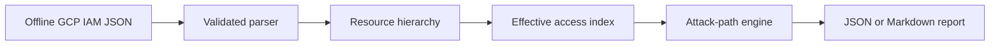

# GCP IAMGraph

GCP IAMGraph is an explainable Google Cloud identity attack-path and least-privilege analyzer. It models resource hierarchy inheritance, IAM role bindings and service-account impersonation to show how an initial identity can reach sensitive access.

> Status: Phase 1 proof of concept. It analyzes a documented offline format with a security-relevant subset of predefined roles. It is not a replacement for Google Cloud Policy Analyzer or a complete implementation of GCP authorization semantics.

## Security problem

GCP access is distributed across organization, folder, project and resource policies. A harmless-looking binding can become dangerous after inheritance or when a principal can impersonate a more privileged service account. GCP IAMGraph connects those relationships and returns the complete path with evidence and remediation.

## Current capabilities

- Organization, folder, project and resource hierarchy
- Inherited allow-policy bindings
- Primitive Owner and Editor role detection
- `allUsers` and `allAuthenticatedUsers` exposure
- Project IAM-policy modification risk
- Long-lived service-account key creation risk
- Multi-hop service-account impersonation search
- JSON and Markdown reports
- CI failure thresholds

## Detection catalog

| Rule | Risk | Default severity |
| --- | --- | --- |
| GCP-IAM-001 | Broad primitive Owner or Editor role | Critical/High |
| GCP-IAM-002 | Public or globally authenticated binding | Critical/High |
| GCP-IAM-003 | Project IAM-policy modification | Critical |
| GCP-IAM-004 | Service-account key creation | High |
| GCP-IAM-005 | Impersonation path to privileged service account | Critical |

## Quick start

Requirements: Python 3.10+

```bash
python -m venv .venv
source .venv/bin/activate
python -m pip install -e .
gcp-iamgraph examples/vulnerable-environment.json --format markdown --output report.md
```

Windows PowerShell activation:

```powershell
.venv\Scripts\Activate.ps1
```

Fail a CI job when high or critical findings exist:

```bash
gcp-iamgraph examples/vulnerable-environment.json --fail-on high
```

## Architecture



## Example attack path

```text
user:developer@example.test
  -> impersonates
serviceAccount:deployment@payments-prod.iam.gserviceaccount.com
  -> roles/owner
projects/payments-prod
```

All included identities and resource IDs are fictional.

## Development

```bash
python -m pip install -e . pytest
pytest -q
```

## Honest limitations

Phase 1 does not yet ingest Cloud Asset Inventory directly or evaluate custom roles, deny policies, principal access boundaries, groups, IAM Conditions, organization policies, product-specific ACLs or every predefined role. Conditional bindings are preserved and identified in evidence but not evaluated. Findings must be reviewed by a qualified cloud-security practitioner before remediation.

## Roadmap

- Cloud Asset Inventory read-only collector
- Complete predefined and custom role permission catalog
- IAM Conditions and deny-policy evaluation
- Group expansion and principal access boundaries
- Additional service-account, Cloud Functions, Compute Engine and deployment escalation paths
- SARIF reports for GitHub code scanning
- FastAPI service and interactive graph UI
- Terraform vulnerable and hardened demonstration environments
- Benchmarks, coverage reports and a formal threat model

## Responsible use

Analyze only environments you own or are authorized to assess. Sanitize exported policies before sharing them and never commit credentials or confidential organization data.

## Author

Parakh Shinde — cybersecurity student focused on cloud security, detection engineering and security automation.

