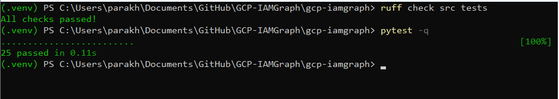
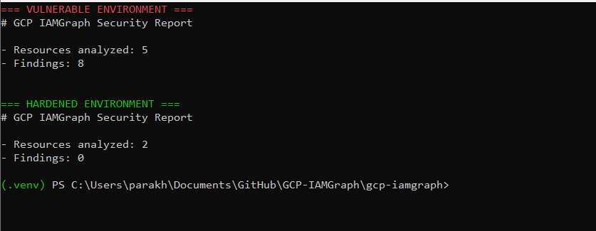
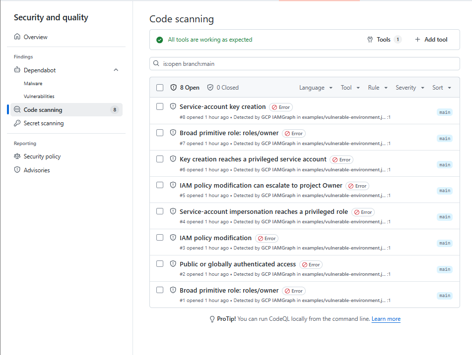
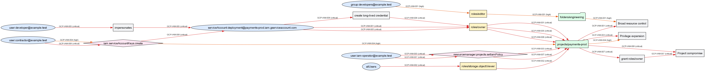
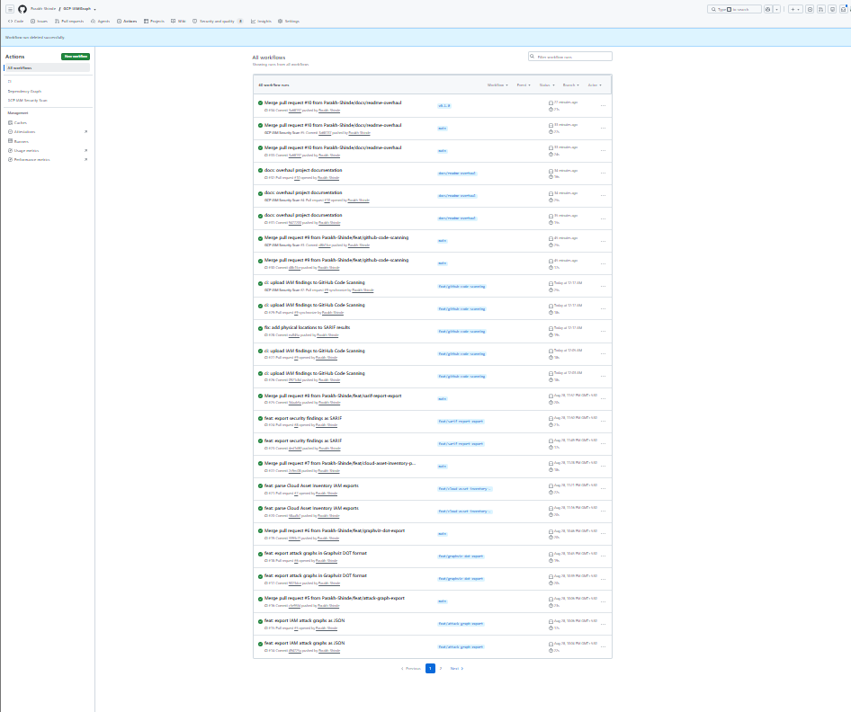
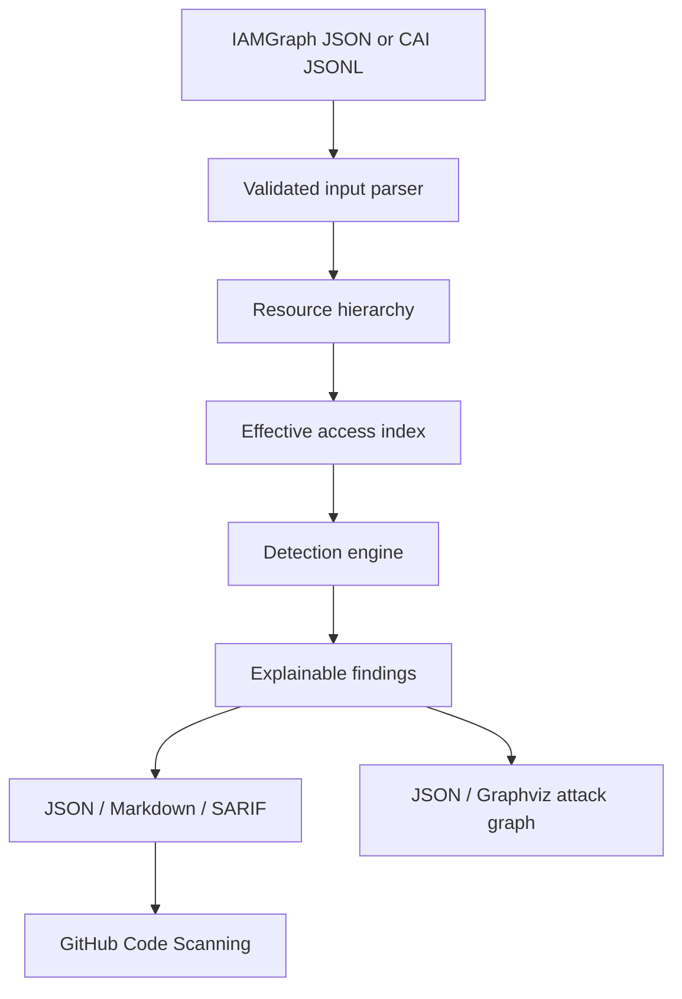
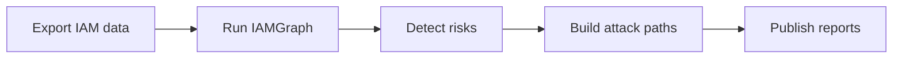

# GCP IAMGraph

[](https://github.com/Parakh-Shinde/GCP-IAMGraph/actions/workflows/ci.yml)
[](https://github.com/Parakh-Shinde/GCP-IAMGraph/actions/workflows/iam-code-scanning.yml)
[](https://www.python.org/)
[](LICENSE)

**Explainable Google Cloud IAM attack-path and least-privilege analyzer.**

GCP IAMGraph models Google Cloud resource hierarchy, inherited IAM bindings, role permissions, service-account relationships, and privilege-escalation paths. It turns isolated IAM grants into security findings that explain:

- who has access;
- where the access originates;
- how the permission is inherited;
- which attack path leads to privileged control;
- what evidence supports the finding;
- how the risk should be remediated.

> GCP IAMGraph is a defensive security analysis project. It does not modify IAM policies or perform exploitation.

## Why this project exists

Google Cloud access is distributed across organizations, folders, projects, service accounts, predefined roles, custom roles, and inherited policies.

A single binding may appear harmless while enabling a dangerous combination such as:

```text
user:developer@example.test
→ compute.instances.create
→ iam.serviceAccounts.actAs
→ privileged service account
→ roles/owner
→ project compromise
```

GCP IAMGraph correlates these relationships and produces explainable findings instead of reporting permissions in isolation.

## Key capabilities

- Native IAMGraph JSON input
- Google Cloud Asset Inventory IAM-policy JSONL input
- Organization, folder, project, and resource hierarchy
- Inherited IAM allow-policy bindings
- Predefined and custom role permission resolution
- Multi-hop service-account impersonation analysis
- Compute Engine and service-account `actAs` escalation analysis
- Privileged service-account key creation paths
- IAM policy modification-to-Owner escalation
- Public and globally authenticated access detection
- Deterministic attack-graph construction
- JSON attack-graph export
- Graphviz DOT visualization export
- JSON, Markdown, and SARIF 2.1.0 security reports
- GitHub Code Scanning integration
- CI failure thresholds for high and critical findings
- Automated tests across Python 3.10, 3.11, and 3.12

## Proof it works

GCP IAMGraph includes reproducible vulnerable and hardened environments, automated tests, generated reports, attack graphs, and GitHub Code Scanning integration.

### Verified results

| Verification | Result |
| --- | --- |
| Automated test suite | 25 tests passed |
| Ruff static checks | All checks passed |
| Vulnerable example | 5 resources analyzed, 8 findings |
| Hardened example | 2 resources analyzed, 0 findings |
| GitHub Code Scanning | 8 IAM security alerts uploaded |
| SARIF | Valid SARIF 2.1.0 output |
| Attack graph | JSON, DOT, SVG, and PNG |

### Reproduce the results

Vulnerable environment:

```powershell
gcp-iamgraph examples\vulnerable-environment.json `
  --format markdown `
  --output vulnerable-report.md
```

Expected:

```text
Resources analyzed: 5
Findings: 8
```

Hardened environment:

```powershell
gcp-iamgraph examples\hardened-environment.json `
  --format markdown `
  --output hardened-report.md
```

Expected:

```text
Resources analyzed: 2
Findings: 0
```
> [!IMPORTANT]
> The GitHub Code Scanning alerts shown in this repository are intentionally
> generated from the fictional `examples/vulnerable-environment.json` IAM
> configuration. They demonstrate GCP IAMGraph's detection capabilities and
> do not represent vulnerabilities in the analyzer's Python source code.

### Generated evidence

- [Vulnerable environment report](docs/demo-output/vulnerable-report.md)
- [Hardened environment report](docs/demo-output/hardened-report.md)
- [SARIF 2.1.0 findings](docs/demo-output/iam-findings.sarif)
- [JSON attack graph](docs/demo-output/attack-graph.json)
- [Graphviz DOT attack graph](docs/demo-output/attack-graph.dot)
- [SVG attack graph](docs/evidence/attack-graph.svg)

<details>
<summary><strong>Automated tests and lint checks</strong></summary>



</details>

<details>
<summary><strong>Vulnerable versus hardened analysis</strong></summary>



</details>

<details>
<summary><strong>GitHub Code Scanning integration</strong></summary>



</details>

<details>
<summary><strong>Rendered IAM attack graph</strong></summary>



</details>

<details>
<summary><strong>GitHub Actions validation</strong></summary>



</details>

## Architecture



## Detection catalog

| Rule | Detection | Severity |
| --- | --- | --- |
| `GCP-IAM-001` | Broad primitive Owner or Editor role | Critical / High |
| `GCP-IAM-002` | Public or globally authenticated access | Critical / High |
| `GCP-IAM-003` | Project IAM policy modification | Critical |
| `GCP-IAM-004` | Service-account key creation | High |
| `GCP-IAM-005` | Impersonation path to a privileged service account | Critical |
| `GCP-IAM-006` | VM creation with privileged service-account `actAs` | Critical |
| `GCP-IAM-007` | IAM policy modification leading to project Owner | Critical |
| `GCP-IAM-008` | Key creation for a privileged service account | Critical |

## End-to-end workflow



Example result:

```text
user:contractor@example.test
→ iam.serviceAccountKeys.create
→ serviceAccount:deployment@payments-prod.iam.gserviceaccount.com
→ create long-lived credential
→ roles/owner
→ projects/payments-prod
→ Project compromise
```

Each finding contains:

- rule ID and severity;
- affected principal and resource;
- human-readable description;
- ordered attack path;
- supporting IAM evidence;
- remediation guidance;
- security references where applicable.

## Requirements

- Python 3.10 or newer
- Git
- Graphviz is optional and only required to render `.dot` files into SVG or PNG

## Installation

Clone the repository:

```bash
git clone https://github.com/Parakh-Shinde/GCP-IAMGraph.git
cd GCP-IAMGraph
```

Create a virtual environment:

```bash
python -m venv .venv
```

Activate it on Linux or macOS:

```bash
source .venv/bin/activate
```

Activate it in Windows PowerShell:

```powershell
.venv\Scripts\Activate.ps1
```

Install the project:

```bash
python -m pip install --upgrade pip
pip install -e .
```

Confirm installation:

```bash
gcp-iamgraph --help
```

## Quick start

Analyze the included vulnerable environment:

```bash
gcp-iamgraph examples/vulnerable-environment.json
```

Create a Markdown report:

```bash
gcp-iamgraph examples/vulnerable-environment.json \
  --format markdown \
  --output report.md
```

Windows PowerShell:

```powershell
gcp-iamgraph examples\vulnerable-environment.json `
  --format markdown `
  --output report.md
```

Analyze the hardened example:

```bash
gcp-iamgraph examples/hardened-environment.json
```

The hardened example is expected to return no findings.

## Cloud Asset Inventory input

GCP IAMGraph accepts newline-delimited JSON exported by Google Cloud Asset Inventory with IAM policy content.

Analyze a CAI export:

```bash
gcp-iamgraph cloud-assets.jsonl \
  --input-format cai
```

Generate a report and attack graph directly from CAI data:

```bash
gcp-iamgraph cloud-assets.jsonl \
  --input-format cai \
  --format markdown \
  --output report.md \
  --graph-format dot \
  --graph-output attack-graph.dot
```

The CAI parser:

- normalizes full Google Cloud asset names;
- reconstructs organization, folder, and project ancestry;
- imports IAM bindings and conditions;
- supports project and service-account assets;
- validates malformed exports with actionable errors.

## Report formats

### JSON

```bash
gcp-iamgraph examples/vulnerable-environment.json \
  --format json \
  --output report.json
```

### Markdown

```bash
gcp-iamgraph examples/vulnerable-environment.json \
  --format markdown \
  --output report.md
```

### SARIF 2.1.0

```bash
gcp-iamgraph examples/vulnerable-environment.json \
  --format sarif \
  --output iam-findings.sarif
```

SARIF results include:

- rule descriptors;
- GitHub-compatible physical locations;
- logical GCP resource locations;
- severity mapping;
- attack paths;
- evidence;
- remediation;
- references.

## Attack-graph export

### JSON graph

```bash
gcp-iamgraph examples/vulnerable-environment.json \
  --graph-format json \
  --graph-output attack-graph.json
```

Graph nodes are classified as:

- principal;
- role;
- resource;
- permission;
- action.

Edges retain the rule ID, severity, principal, and affected resource.

### Graphviz DOT

```bash
gcp-iamgraph examples/vulnerable-environment.json \
  --graph-format dot \
  --graph-output attack-graph.dot
```

Render the graph as SVG:

```bash
dot -Tsvg attack-graph.dot -o attack-graph.svg
```

Render it as PNG:

```bash
dot -Tpng attack-graph.dot -o attack-graph.png
```

DOT output uses distinct styles for principals, roles, resources, permissions, and actions. Edge colors represent finding severity.

## CI security gates

Fail when at least one critical finding exists:

```bash
gcp-iamgraph examples/vulnerable-environment.json \
  --fail-on critical
```

Fail when a high or critical finding exists:

```bash
gcp-iamgraph examples/vulnerable-environment.json \
  --fail-on high
```

Available thresholds:

```text
none
high
critical
```

## GitHub Code Scanning

The repository contains an automated workflow at:

```text
.github/workflows/iam-code-scanning.yml
```

The workflow:

1. installs GCP IAMGraph;
2. analyzes the vulnerable demonstration environment;
3. generates a SARIF 2.1.0 report;
4. preserves the report as a workflow artifact;
5. uploads findings to GitHub Code Scanning.

The alerts appear under:

```text
Security → Code scanning
```

The vulnerable example is intentionally scanned to demonstrate how IAMGraph findings appear in GitHub’s security interface.

## Project structure

```text
gcp-iamgraph/
├── .github/
│   └── workflows/
│       ├── ci.yml
│       └── iam-code-scanning.yml
├── examples/
│   ├── hardened-environment.json
│   └── vulnerable-environment.json
├── src/
│   └── gcp_iamgraph/
│       ├── access.py
│       ├── cli.py
│       ├── detections.py
│       ├── graph.py
│       ├── hierarchy.py
│       ├── models.py
│       ├── parser.py
│       ├── reporting.py
│       └── roles.py
├── tests/
├── LICENSE
├── README.md
├── SECURITY.md
└── pyproject.toml
```

## Development

Install test and lint tools:

```bash
pip install -e . pytest ruff
```

Run formatting:

```bash
ruff format src tests
```

Run lint checks:

```bash
ruff check src tests
```

Run the test suite:

```bash
pytest -q
```

The project currently includes 25 automated tests covering:

- models and parsing;
- hierarchy inheritance;
- predefined and custom roles;
- direct risk detections;
- multi-hop attack paths;
- Cloud Asset Inventory ingestion;
- graph construction;
- Graphviz rendering;
- report generation;
- SARIF output;
- CLI behavior.

## Security design principles

- Read-only analysis
- Explainable findings
- Deterministic output
- Evidence attached to every result
- Explicit remediation guidance
- No credential collection
- No automatic IAM changes
- Fictional test identities and resources
- Safe vulnerable and hardened examples

## Limitations

GCP IAMGraph is an engineering project and not a complete implementation of Google Cloud authorization semantics.

Current limitations include:

- a security-focused subset of predefined role permissions;
- no automatic retrieval of custom-role definitions from Google Cloud;
- IAM Conditions are preserved but not evaluated;
- IAM deny policies are not evaluated;
- principal access boundaries are not evaluated;
- Google Group membership is not expanded;
- organization policies and product-specific ACLs are not evaluated;
- findings require validation before production remediation.

It is not a replacement for Google Cloud Policy Analyzer, Security Command Center, or a formal cloud-security review.

## Roadmap

- Automatic predefined-role catalog synchronization
- Live, read-only Google Cloud collector
- IAM Conditions evaluation
- Deny-policy analysis
- Google Group expansion
- Principal access boundary support
- Terraform IAM ingestion
- Interactive attack-graph interface
- Additional serverless and deployment escalation paths
- Performance benchmarks for large organizations
- Formal threat model and detection documentation

## Responsible use

Analyze only environments you own or are explicitly authorized to assess.

Before sharing exported policies:

- remove credentials and secrets;
- sanitize organization and project identifiers;
- replace real user and service-account names;
- avoid committing confidential IAM data.

All identities and resource identifiers in the included examples are fictional.

## Author

**Parakh Shinde**

Cybersecurity student focused on cloud security, detection engineering, IAM attack paths, and security automation.